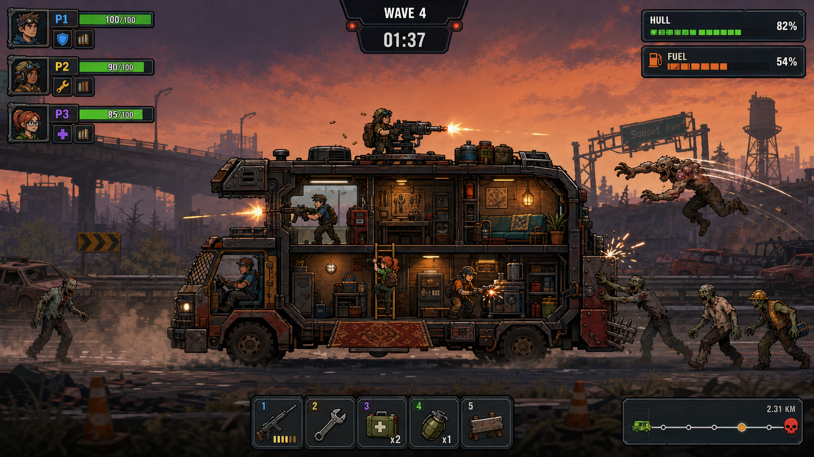

# Godot再開発 マスターゲーム仕様 v0.1

> 状態: 開発前レビュー用の固定案
> 対象: Godot版「移動車両型・協力Waveサバイバル」
> 旧HTML5/Unity版は参考実装とし、Godot版は本書を正とする。
> 本書の数値は初期実装値。テストで調整してよいが、ゲームルールを変える場合は仕様変更として記録する。

関連仕様:

- [14_godot-technical-spec.md](14_godot-technical-spec.md): Godot・ネットワーク・データ構造
- [16_combat-vehicle-balance.md](16_combat-vehicle-balance.md): Wave・敵・武器・車両数値
- [17_progression-catalog.md](17_progression-catalog.md): レリック24種・個人スキル48種
- [18_route-ui-acceptance.md](18_route-ui-acceptance.md): ルート・HUD・受け入れ条件



この画像は画面密度、断面車両、車内外の同時戦闘、HUD配置の基準であり、個別アセットの完成デザインではない。

## 0. ゲームの憲法

### 一文コンセプト

```text
1〜4人のクルーが、走り続ける小型車両の中を動き回り、
車両を改装しながらゾンビと怪物のWaveを耐え、分岐する終末世界を走破する協力ローグライト。
```

### プレイヤーに約束する体験

1. 車両は「守る対象」であると同時に、プレイヤーが作り替える家・武器・成長盤である。
2. 戦闘が得意な人、修理や設備運用が好きな人、探索や支援が好きな人が同じチームで活躍できる。
3. Wave 1〜9後の選択で、プレイヤー中心・車両中心・特殊ルール中心の異なるビルドになる。
4. 車両は画面左を向いて右から左へ走り、背景は相対的に左から右へ流れる。車両は画面中央に留め、常に前進している視覚体験を保つ。
5. 1ランは約25〜35分。失敗しても次のランで別の組み合わせを試したくなる長さにする。

### 固定する勝敗条件

- 勝利: 全10Waveを突破し、Wave 10の最終ボスから離脱する。
- 敗北: 車両の耐久値が0になる。
- プレイヤーの戦闘不能だけでは敗北しない。一定時間後に車内へ復帰できる。
- 全員が同時に戦闘不能になると車両が無防備になるが、耐久値が残っている限りランは継続する。

### 今回作らないもの

- 車両そのものの左右運転操作
- オープンワールドや自由走行
- 5人以上のマルチプレイ
- PvP、フレンドリーファイア
- 複雑な配線、流体、ベルトコンベア式の工場
- 空腹、渇き、睡眠などの生活ゲージ
- ランダム生成された巨大な車内
- 初期リリースでのホスト移行、途中参加、ローカル画面分割

---

## 1. 1Waveの基本ループ

### 1.1 1ランの構成

- 1ランは10Wave。
- Wave 1〜4が地域1、Wave 5が中ボス。
- Wave 6〜9が地域2、Wave 10が最終ボス。
- Wave 1〜4は各90秒、Wave 5は120秒。
- Wave 6〜9は各105秒、Wave 10は150秒を初期値とする。
- 通常Waveは時間切れで「離脱フェーズ」へ移る。残敵の全滅は要求しない。
- ボスWaveは時間経過に加え、ボス固有の離脱条件を満たす必要がある。

### 1.2 ゲーム進行

```text
ロビー
  ↓
キャラクター・初期装備選択
  ↓
ルートマップで次のステージを選択
  ↓
準備 30秒（全員準備完了で短縮可能）
  ↓
Wave戦闘 90〜150秒
  ↓
離脱 10秒
  ↓
戦果精算
  ↓
共有レリック3択
  ↓
修理・車両改装・個人スキル選択
  ↓
ルートマップ
```

### 1.3 準備フェーズ

- 敵は出現せず、背景スクロールは低速。
- プレイヤーは車両モジュールの設置、移動、撤去、修理、弾薬補充を行える。
- 制限時間は30秒。全プレイヤーが「準備完了」にすると3秒後に開始する。
- UIやメニューを開いているプレイヤーがいても、残り5秒で自動的に閉じる。
- 車両改装は準備フェーズ中のみ可能。戦闘中は修理と設備操作のみ可能。

### 1.4 戦闘フェーズ

- 車両のワールド座標は固定する。
- 背景・道路・路上オブジェクトを右方向へ動かし、画面左へ走る車両の前進を表現する。敵の移動は前方/後方レーンごとの相対速度で扱う。
- 敵は前方、後方、屋根、飛行レーンから出現する。
- 画面上部に残り時間、Wave番号、現在の危険イベントを表示する。
- 敵の撃破数はスコアと一部報酬に影響するが、通常Waveのクリア条件ではない。
- 時間切れ後は10秒の離脱フェーズに入り、新規スポーンが止まる。車両が生存すればクリア。

### 1.5 戦果と報酬

- 基本報酬: スクラップ、補給物資、共有レリック1個。
- スクラップ量はステージ種別、撃破数、車両損傷、任意目標で変化する。
- 車両損傷による報酬減少は最大20%に制限し、劣勢から回復不能になることを防ぐ。
- 任意目標は1Waveにつき最大1つ。「エリート撃破」「外装を一定以上維持」「救難物資回収」など短く読めるものにする。

### 1.6 中断とセーブ

- ソロはWave間で中断保存できる。
- マルチはホストがWave間で中断保存でき、同じメンバーで再開できる。
- 戦闘中の中断保存は行わない。
- 保存対象はシード、現在Wave、ルート、車両状態、所持品、レリック、キャラクター成長、乱数状態。

---

## 2. 車内の広さ・階層・移動方法

### 2.1 表示と座標

- 2D横視点、正投影。
- 基準解像度は1920×1080、16:9。UIは1280×720まで破綻しないこと。
- 車両は画面横幅の45〜60%、画面高の45〜55%を占める。
- 車内は断面表示し、外壁の手前側を描画しない。
- カメラは全プレイヤーと車両全体が原則1画面に収まる。個別カメラや画面分割は行わない。

### 2.2 車両グリッド

- 車内設備は論理グリッドに配置する。
- 最大フレームは横12セル×縦6セル。
- 初期車両は横8セル×縦4セル、2階層。
- 1セルはゲーム内64px相当を基準とし、実際の表示倍率からは分離する。
- 初期状態の歩行可能領域は各階に横6セル以上を確保する。
- モジュールは1×1、2×1、2×2のいずれか。通路セルを完全に塞ぐ配置は不可。
- Wave 5突破後にフレーム拡張を1回行え、最大で横10セル×縦5セルまで解放する。
- 最大12×6は将来コンテンツ用の上限とし、初期リリースの通常ランでは使い切らない。

### 2.3 プレイヤー移動

- 基本操作: 左右移動、ジャンプ、下り、はしご、回避、インタラクト。
- 足場は片方向床にでき、下入力+ジャンプで降りられる。
- 階層移動は固定はしごと昇降ハッチを使う。
- プレイヤー同士に物理衝突はなく、すり抜ける。
- 設備は背景側に置き、原則として移動を妨げない。大型設備だけが配置制限を持つ。
- 車内の左右端には乗降ハッチ、上部には屋根ハッチを置く。

### 2.4 車外行動

- 屋根は歩行可能な高リスク戦闘エリア。
- 側面の小型足場は短時間の物資回収・修理用エリア。
- 車外では敵の攻撃、障害物、落下の危険が増える。
- 車両から取り残された場合は3秒の警告後、安全位置へ牽引され、最大HPの25%ダメージを受ける。
- 即死落下は採用しない。

### 2.5 射撃と視線

- 車内からは射撃窓、開いたハッチ、武器ステーションを通して外を攻撃する。
- 通常壁は弾を遮る。射撃窓はプレイヤー弾を通し、敵弾の一部を防ぐ。
- プレイヤーの照準は360度。ゲームパッドは右スティック、キーボードはマウス照準。
- 照準線は自分だけに薄く表示し、他プレイヤーの視認性を妨げない。

### 2.6 敵の侵入

- 外装セグメントが破壊されると、その位置に「侵入口」ができる。
- クライマー、ランナー、小型敵は侵入口から車内へ入れる。
- 車内の敵は最寄りのプレイヤー、設備、操縦席コアの順に狙う。
- 侵入口は戦闘中に応急修理でき、Wave間に完全修復できる。

---

## 3. プレイヤーごとの役割と操作

### 3.1 共通能力

全キャラクターが次を行える。役割選択で基本行動を禁止しない。

- 移動、ジャンプ、回避
- メイン武器、サブ武器、近接押し返し
- 設備操作、応急修理、味方蘇生
- 車両モジュールの設置・撤去（準備中のみ）
- 車外物資の回収

### 3.2 初期キャラクター4種

| 役割 | 得意 | 固有アクション | 初期パッシブ |
|---|---|---|---|
| ガンナー | 直接戦闘 | 6秒間、反動とリロード時間を軽減 | 個人武器ダメージ+10% |
| エンジニア | 修理・設備 | 修理ドローンを8秒展開 | 修理速度+35%、設備操作速度+15% |
| スカウト | 車外行動・回収 | 短距離グラップル | 回避距離+20%、牽引ペナルティ半減 |
| オペレーター | 車載武器・支援 | 画面内の敵を4秒マーキング | 車載武器の旋回・冷却速度+20% |

- 同じ役割の重複選択を許可する。
- 役割差は強みであり、必須編成を作らない。
- ソロ時は設備の基本自動化と修理ドローンの簡易版を全キャラクターに付与する。

### 3.3 入力

| 行動 | キーボード/マウス | ゲームパッド |
|---|---|---|
| 移動 | A/D | 左スティック |
| ジャンプ/上る | Space | Southボタン |
| 降りる | S+Space | 下+South |
| 照準 | マウス | 右スティック |
| 射撃 | 左クリック | 右トリガー |
| サブ/近接 | 右クリック | 左トリガー |
| 回避 | Shift | Eastボタン |
| インタラクト/修理 | E長押し | Westボタン長押し |
| 固有アクション | Q | Northボタン |
| ピン | 中クリック | 右スティック押し込み |

- キーコンフィグ対応を必須とする。
- 操作対象が重なった場合は、キャラクターに近い対象を優先し、候補切替UIを出す。

### 3.4 戦闘不能と復帰

- HPが0になると20秒のダウン状態になる。
- 味方は3秒間インタラクトして蘇生できる。複数人で蘇生すると最大2倍まで短縮。
- 蘇生後は最大HPの35%で復帰し、2秒間無敵。
- 20秒経過で離脱扱いとなり、さらに8秒後に車内の安全地点へ最大HP50%で復帰。
- 全員離脱中でも車両が生存していれば復帰可能。

### 3.5 個人成長

- 敵撃破、任意目標、Wave突破で「クルー経験値」を全員が同量得る。キルの奪い合いを作らない。
- Wave 2、5、8終了時に各プレイヤーは個人スキルを3択から1つ選ぶ。
- 個人スキルは攻撃、生存、固有能力の3系統。
- 選択は各自で独立し、他プレイヤーの待ち時間中も車内改装を行える。
- ラン外のキャラクターマスタリーは初期装備、選択肢、外見を解放する。恒久的な基礎火力上昇は最大5%相当に抑える。

### 3.6 基本ステータス

- HP、移動速度、回避クールダウン
- 武器ダメージ、攻撃速度、リロード速度、クリティカル率
- 固有アクションのクールダウン
- 修理速度、設備操作速度
- 防御力は原則持たず、シールドを一時HPとして扱う。

---

## 4. 車両改装のマス配置ルール

### 4.1 車両の成長軸

| 軸 | 内容 | 主な影響 |
|---|---|---|
| フレーム | 使用可能セルと外装スロット | 車内面積、設置数、侵入口 |
| 耐久 | 車体、装甲、応急修理 | 敗北までの余裕 |
| 動力 | エンジン、発電機、バッテリー | 電力上限、ステージ効果 |
| 武装 | タレット、射撃窓、迎撃装置 | 自動火力、射線 |
| 支援 | 医療、工作、レーダー、保管 | 回復、修理、報酬、情報 |
| 内装 | 壁紙、床、照明、家具 | 見た目、軽い快適度ボーナス |

### 4.2 配置制約

- 機能モジュールはグリッドを使用し、スクラップと電力容量を消費する。
- 配線作業は行わない。発電量が総消費電力以上なら全設備が稼働する。
- 電力不足時はプレイヤーが設備ごとに優先度を3段階で指定する。
- 各階に左右をつなぐ歩行経路を1セル以上残す。
- はしごの上下1セルは塞げない。
- 外装モジュールは外周専用スロット、内装モジュールは車内セルに置く。
- 壁紙、床材、絵、照明色などの装飾は別レイヤーで、機能モジュール枠を消費しない。

### 4.3 資源

- スクラップ: モジュール購入、修理、アップグレードに使う共有通貨。
- 補給物資: 消耗品、弾薬、医療品をまとめた共有資源。
- 燃料: ルート進行に必要。通常ルートでは不足しないが、危険ルートやイベントの選択コストになる。
- 電力: ラン中の恒久資源ではなく、発電と消費の容量値。
- 資源種はこの4つ以上に増やさない。

### 4.4 車両ダメージ

- 車体耐久は共有の敗北HP。
- 外装は前部、後部、屋根、下部の4セクションに分かれる。
- 外装が残っている間、その方向からの車体ダメージを肩代わりする。
- モジュールは個別HPを持つ。HP0で停止するが消失しない。
- 修理は補給物資を消費する。戦闘中は最大HPの60%まで、Wave間は100%まで直せる。
- 同じ場所への集中攻撃が侵入を生むため、単一の全体HPバーだけにはしない。

### 4.5 初期モジュール候補

| 系統 | モジュール | サイズ | 機能 |
|---|---|---:|---|
| 必須 | 操縦席コア | 2×1 | 破壊されると車体へのダメージ増加。撤去不可 |
| 動力 | 小型発電機 | 2×1 | 電力を供給 |
| 動力 | バッテリー | 1×1 | 一時的な電力不足を吸収 |
| 武装 | 射撃窓 | 外装1 | 車内から安全に射撃 |
| 武装 | 自動タレット | 外装2 | 電力を使い自動攻撃 |
| 武装 | スパイクバンパー | 外装2 | 前方接触敵にダメージ |
| 支援 | 工作台 | 2×1 | 修理効率とモジュール強化を解放 |
| 支援 | 医療ベッド | 2×1 | Wave間回復、復帰時間短縮 |
| 支援 | レーダー | 1×1 | 特殊敵と次の襲撃方向を予告 |
| 支援 | 補給棚 | 1×1 | 補給物資の上限を増加 |
| 特殊 | デコイ投射器 | 外装1 | 敵の狙いを短時間そらす |
| 特殊 | 回収アーム | 外装2 | 車外に出ず一部物資を回収 |

### 4.6 改装の取り消し

- Wave間の設置・移動は確定ボタンを押すまで無料で戻せる。
- 購入したモジュールの売却額は購入額の70%。同じ準備フェーズ中の誤購入は100%返金。
- 破壊済みモジュールも売却可能だが、売却額は購入額の35%。

### 4.7 内装とオリジナリティ

- 装飾は機能枠を消費しない。
- ラグ、壁紙、照明、植物、ベッド、トロフィーなどを配置できる。
- 一部家具は「快適度」を持ち、合計値に応じてWave間のHP回復やレリック再抽選ポイントを少量付与する。
- 快適度の戦闘寄与は小さくし、好みの外観を壊して最適化する必要がない設計にする。
- マルチでは装飾の配置・撤去を行ったプレイヤー名を短時間表示し、荒らし対策としてホストが改装権限を制限できる。

---

## 5. 敵の侵入・攻撃・回避方法

### 5.1 敵ディレクター

- 各Waveは「脅威予算」を持つ。
- 敵ごとに出現コストを設定し、ディレクターが予算内で編成を作る。
- 難易度はHP倍率だけでなく、侵入経路、敵の組み合わせ、危険イベントで作る。
- Wave内は導入20%、本隊55%、ラッシュ25%の3区間。
- 強いラッシュの直後には8〜12秒の低圧時間を作る。
- 同時出現数にはプラットフォーム別上限を設ける。初期PC目標は通常敵40体、軽量敵を含め最大60体。

### 5.2 初期敵ロスター

| 敵 | 役割 | 主な対処 |
|---|---|---|
| ウォーカー | 遅い群れ | 範囲攻撃、押し返し |
| ランナー | 高速接近 | 優先射撃、射撃窓 |
| ブルート | 高耐久・外装破壊 | 集中攻撃、弱点狙い |
| クライマー | 車体に張り付き屋根へ侵入 | 屋根対応、電撃設備 |
| リーパー | 予告後に車内へ飛び込む | 回避、着地点から離れる |
| スピッター | 遠距離酸攻撃 | 射線変更、迎撃、外へ出て処理 |
| バット変異体 | 飛行・設備狙い | 上方向射撃、屋根タレット |
| ボマー | 倒されるか接近すると爆発 | 早期処理、押し返し |
| サモナー | 小型敵を追加 | マークして優先撃破 |
| ドリラー | 下部から侵入口を作る | 警告地点の防衛、床補強 |

- Wave 1でウォーカー、Wave 2でランナー、Wave 3でクライマーを紹介する。
- 新敵は初登場Waveでは単独または少数で出し、次Waveから組み合わせる。
- 中ボスは外装セクションを順に狙う「ハルク」。最終ボスは複数経路を封鎖する「コロニー」とする。名称変更は演出制作時に可能だが、内部IDは維持する。

### 5.3 攻撃の読みやすさ

- 大ダメージ攻撃は0.6秒以上の予告を持つ。
- 地面攻撃は形と色を統一した予告領域を出す。
- 車内への飛び込み地点は外壁と床の両方に表示する。
- 画面外からの攻撃は方向インジケーターと音で知らせる。
- 赤色だけに依存せず、形、点滅、効果音を併用する。

### 5.4 プレイヤーの回避手段

- 回避行動は短距離移動+0.2秒の無敵、基礎クールダウン1.4秒。
- しゃがみ専用操作は設けず、低い攻撃はジャンプ、高い攻撃は床降りで避ける。
- 近接押し返しはダメージが低い代わりに、小型敵との間合いを作る。
- ドア閉鎖、デコイ、車載迎撃装置でチームとして攻撃を避けられる。

### 5.5 ステージ危険イベント

- 道路障害: 車内に衝撃が入り、立っているプレイヤーと一部設備が揺れる。
- トンネル: 一時的に暗くなり、飛行敵が減る代わりに侵入敵が増える。
- 酸性雨: 屋根上の継続ダメージ。屋内行動を促す。
- 群れ横断: 短時間だけ前方の敵密度が上がる。
- 危険イベントは1Wave最大1種類。ボス固有ギミックとは重ねない。

---

## 6. レリック・スキル・ステータス成長

### 6.1 成長を3層に分ける

| 層 | 所有者 | 選択タイミング | 例 |
|---|---|---|---|
| 共有レリック | チーム全体 | Wave 1〜9後 | 全員の射撃、車両、ルール変更 |
| 個人スキル | 各プレイヤー | Wave 2・5・8後 | 固有能力、個人武器、生存 |
| 車両モジュール | チーム全体 | 準備フェーズ | タレット、医療、発電、内装 |

この3層を混ぜず、誰の強化かをUIの色とアイコンで明示する。

### 6.2 共有レリックの3系統

| 系統 | 色 | 内容 |
|---|---|---|
| 戦闘 | 赤橙 | プレイヤー武器、クリティカル、貫通、状態異常 |
| 車両 | 青緑 | 車体、修理、電力、車載武器、設備 |
| 特殊 | 紫 | 資源変換、リスク付き効果、ステージルール変更 |

- Wave 1〜9クリア後にチーム共通の3択を1回提示する。Wave 10後はリザルトへ進む。
- 各プレイヤーが投票し、多数決で決定する。
- 同票は20秒の投票終了時に同票候補からランダム決定する。
- ホストによる強制決定は通常行わない。プライベート設定でのみ許可する。
- 3択のうち最低1枚は現在所持している最多系統、最低1枚は別系統から出す。
- チームは1ランにつき初期1回、イベント等で最大3回まで再抽選できる。

### 6.3 レアリティと出現率

| Wave帯 | コモン | レア | エピック | レジェンダリ |
|---|---:|---:|---:|---:|
| 1〜3 | 70 | 28 | 2 | 0 |
| 4〜6 | 45 | 40 | 14 | 1 |
| 7〜9 | 20 | 40 | 33 | 7 |

- Wave 5後の3択にエピック以上を1枚保証する。
- Wave 9後の3択にレジェンダリを1枚保証する。
- 同一の加算・倍率系レリックは原則3スタックまで。
- ルール変更系、リスク系、即時効果系は原則スタック不可。

### 6.4 初期レリックの構成数

- 初期プレイアブル版は24種。
- 戦闘8、車両8、特殊8に均等配分する。
- そのうち6種は特定の2枚で進化する3組のシナジーにする。
- 旧版の「速射」「跳弾」「砲術」「連射砲」「自己修復」「ゾンビ燃料」などは新カテゴリへ移植する。
- 32種カタログは製品版候補として残し、最初から全実装しない。

### 6.5 シナジー初期3組

| 組み合わせ | 進化 | 効果方針 |
|---|---|---|
| 速射 + 跳弾 | 弾幕 | 貫通後の威力減衰をなくし、攻撃速度上限を緩和 |
| 砲術 + 連射砲 | 管制システム | 車載武器が追加目標を同時追尾 |
| 回収効率 + ゾンビ燃料 | 前線再資源化 | 敵ドロップを自動回収し、一部を補給物資へ変換 |

### 6.6 個人スキル

- 各キャラクターに12個用意し、攻撃4、生存4、固有能力4に分ける。
- 1ランで選べるのは3個。全取得はできない。
- 3択は必ず異なる系統を1つずつ提示する。
- 個人スキルに車両全体の必須性能を置かない。
- 同キャラクターが複数いても、それぞれ別のスキルを選べる。

### 6.7 ラン外成長

- ラン結果でキャラクター経験値と設計図ポイントを得る。
- キャラクター経験値は初期武器バリエーション、固有スキル候補、衣装を解放する。
- 設計図ポイントは新モジュールをラン内の出現プールへ追加する。
- 恒久強化だけで難易度を踏み倒さない。解放は選択肢の拡張を中心とする。
- 装飾はチャレンジ、実績、ラン中の発見で解放する。

---

## 7. Slay the Spire型ステージマップ

### 7.1 基本構造

- Wave後に横方向へ進む分岐マップを表示する。
- マップは10列で、1列が次のWaveに対応する。
- 各列は2〜3ノード、隣接列へ線で接続する有向非巡回グラフ。
- Wave 5とWave 10は固定ボスノード。
- プレイヤーは常に接続された2〜3候補から次を投票する。
- 全体マップは先まで見えるが、イベントの詳細報酬は直近2列までしか分からない。

### 7.2 ノード種別

すべてのノードでWave戦闘は発生する。ノード種別は敵構成、危険、クリア後サービスを変える。

| ノード | 戦闘 | クリア後 |
|---|---|---|
| 道路 | 標準 | 標準スクラップ、通常レリック |
| 廃品回収地 | 敵数多め、回収物あり | スクラップ多め、モジュール候補 |
| ガレージ | 車両への集中攻撃 | 修理割引、モジュール購入・移動 |
| 救難信号 | 防衛・護衛の任意目標 | 個人回復、キャラクター系イベント |
| 異常地帯 | 特殊ルール1つ | 特殊レリック率上昇 |
| エリート | 固有能力付きエリート | レア以上保証、報酬増加 |
| ボス | 固有ギミック | 地域突破、フレーム拡張または大報酬 |

### 7.3 ルート選択

- 各プレイヤー1票。20秒で締切。
- 多数決。同票時は同票候補からランダム。
- ソロは即決定。
- 選択前に想定脅威、主な敵、危険イベント、主要報酬、燃料コストを表示する。
- 燃料不足で通常ルートが選べなくなることはない。高報酬の遠回りだけが追加燃料を要求する。

### 7.4 マップ生成ルール

- 各列は最低2ノード。
- 直前と同じノード種別を3回連続させない。
- Wave 1は道路固定。
- Wave 2〜4にガレージを最低1つ、エリートを最大1つ配置。
- Wave 6〜9にガレージを最低1つ、エリートを1〜2つ配置。
- 異常地帯とエリートを同一列に両方必須選択として置かない。
- すべてのルートがWave 5、10のボスへ収束する。
- 生成シードを保存・共有し、マルチの全端末で同じ表示にする。

### 7.5 地域差

- 地域1「崩壊郊外」: 基本敵、道路障害、夕景。ゲームのルールを順に紹介する。
- 地域2「汚染工業地帯」: 酸、トンネル、飛行・遠距離敵。車両ビルドを試す。
- 最終区間「群体巣道」: Wave 10専用背景とボスギミック。
- 地域ごとに背景3〜5レイヤー、路上オブジェクト、色調、敵出現テーブルを変える。

---

## 8. マルチプレイ人数と同期方式

### 8.1 対応範囲

- 1〜4人オンライン協力。
- 最初の製品目標はフレンド招待によるプライベートルーム。
- 公開マッチメイクは後続。
- 初期開発中はGodotのENetによるIP/ローカル接続で検証し、配信基盤は後からSteamへ接続する。
- ローカル画面分割は初期対象外。

### 8.2 権威モデル

- ホスト権威型。
- ホストが車両HP、敵AI、スポーン、ダメージ、報酬、乱数、マップ進行を確定する。
- クライアントは自分の入力を送信し、移動を予測表示する。
- ホストは定期スナップショットで位置と状態を補正する。
- 弾の見た目は各端末で即時表示し、命中とダメージはホストが確定する。
- 車両改装、レリック、ルート投票は信頼性のあるRPCで同期する。

### 8.3 同期対象

| 高頻度 | イベント同期 | 低頻度/確定時 |
|---|---|---|
| プレイヤー位置・速度・照準 | 射撃、命中、回避、蘇生 | 車両レイアウト |
| 主要敵位置・状態 | 敵出現・死亡・侵入 | レリック・スキル |
| 車体と外装HP | モジュール故障・修理 | ルートマップ・投票 |
| Wave残り時間 | 危険イベント開始 | 資源・戦果・セーブ |

- 背景パララックス、粒子、薬莢、軽微な破片は同期せず、各端末で再生する。
- 大量の小型敵はホスト状態を基準に補間し、完全な決定論同期は要求しない。

### 8.4 参加・切断

- 新規参加はロビーおよびWave間のみ許可する。
- 戦闘中に切断したプレイヤーはAI代行せず、そのキャラクターを安全地点へ退避させる。
- 90秒以内の再接続は同じキャラクター、スキル、装備で復帰できる。
- ホスト切断時のホスト移行は初期リリースでは行わず、セッション終了と中断データ保存を試みる。
- ホストは準備フェーズ中にプレイヤーのキックと改装権限の変更ができる。

### 8.5 人数スケーリング

| 人数 | 敵脅威予算倍率 | エリートHP倍率 | 報酬倍率 |
|---:|---:|---:|---:|
| 1 | 1.00 | 1.00 | 1.00 |
| 2 | 1.55 | 1.10 | 1.35 |
| 3 | 2.05 | 1.20 | 1.60 |
| 4 | 2.45 | 1.30 | 1.80 |

- 通常敵のHPは人数で増やさず、主に数と組み合わせを増やす。
- 復帰時間は人数で変えない。
- ソロだけ設備の簡易自動化と修理支援を付与する。

### 8.6 通信と協力UI

- 画面内ピン: 敵、侵入口、設備、ルート候補、物資。
- 定型メッセージ: 「ここを修理」「援護して」「準備完了」「危険」。
- ボイスチャットはゲーム内実装せず、Steam等の外部機能に任せる。
- 各プレイヤーのHP、ダウン状態、固有アクションクールダウンを左上に表示する。
- 車体、外装4方向、電力、補給物資、燃料は右上の共有HUDに表示する。

---

## 9. 画面遷移

```text
起動
├─ 設定
├─ ソロ開始
└─ マルチ
   ├─ ルーム作成
   └─ 招待参加
        ↓
ロビー / キャラクター選択
        ↓
ラン開始
        ↓
ルートマップ → 準備 → Wave → 戦果/レリック → 改装
        ↑                                      ↓
        └──────────────────────────────────────┘
        ↓
勝利 / 敗北リザルト
        ↓
アンロック表示 → ロビーまたはメインメニュー
```

## 10. HUDの固定レイアウト

- 左上: P1〜P4のHP、ダウン、役割アイコン。
- 上中央: Wave番号、残り時間、危険イベント。
- 右上: 車体HP、外装状態、電力、燃料。
- 左下: 自分の武器、弾倉、固有能力、回避。
- 下中央: インタラクト対象、修理進捗、短い通知。
- 右下: ステージ進行距離と任意目標。
- 車内中央に常設UIを重ねない。
- ダメージ表示は重要なものだけに絞り、通常ダメージ数値の大量表示は設定でOFFを初期値とする。

## 11. Godot実装の前提構造

### 11.1 主要シーン

```text
Boot
MainMenu
Lobby
Run
├─ StageDirector
├─ Vehicle
│  ├─ InteriorGrid
│  ├─ ExteriorSlots
│  ├─ Modules
│  └─ Players
├─ EnemyDirector
├─ ParallaxWorld
├─ Projectiles
└─ HUD (CanvasLayer)
RewardScreen
RouteMap
ResultScreen
```

### 11.2 状態機械

```text
LOBBY → ROUTE_SELECT → PREPARE → COMBAT → ESCAPE
      → REWARD → REMODEL → ROUTE_SELECT
      → VICTORY / DEFEAT
```

- 状態遷移はホストだけが確定する。
- UIがゲームルールを直接変更せず、コマンドをゲーム状態へ送る。
- ソロも内部的にはホスト1人の同じ経路を通し、別ロジックを作らない。

### 11.3 データ駆動

GodotのResourceで次を定義し、ロジックへ数値を直書きしない。

- CharacterDefinition
- WeaponDefinition
- EnemyDefinition
- WaveDefinition
- StageModifierDefinition
- VehicleModuleDefinition
- RelicDefinition
- SkillDefinition
- RouteNodeDefinition
- BiomeDefinition

各定義は安定した文字列IDを持つ。セーブデータとネットワークでは表示名ではなくIDを使う。

### 11.4 衝突レイヤー

- Player
- PlayerProjectile
- Enemy
- EnemyProjectile
- VehicleInterior
- VehicleExterior
- Module
- Interactable
- Pickup
- Hazard

レイヤー番号はプロジェクト開始時に固定し、後から用途を使い回さない。

## 12. 初期開発スコープ

### 12.1 最小プレイアブル・スライス

次が1つの実行ファイルで最後まで遊べたら、ゲーム性検証を開始できる。

- 1〜2人のENet接続
- 初期車両8×4、2階層
- ガンナーとエンジニア
- 移動、ジャンプ、はしご、照準、射撃、回避、修理、蘇生
- 背景3レイヤーの左→右スクロール（車両は画面左向き）
- 敵3種: ウォーカー、ランナー、クライマー
- 90秒Waveを2回
- 外装破壊と侵入
- モジュール4種: 発電機、射撃窓、タレット、工作台
- Wave後レリック3択と投票
- 2列だけのルート選択
- 車両破壊による敗北、2Wave突破による仮勝利

### 12.2 フルラン・アルファ

- 1〜4人
- 10Wave、地域2種、ボス2種
- キャラクター4種
- 通常敵10種
- モジュール12種以上
- 共有レリック24種、進化3組
- 各キャラクター個人スキル12種
- ルートノード7種
- 中断保存、再接続
- キーボード/マウスとゲームパッド

## 13. 開発開始ゲート

以下を満たすまで本実装へ入らない。

- [x] 依頼された1〜8をv0.1の固定仕様として文書化している。
- [x] 最小スライスとフルラン・アルファの境界を文書化している。
- [x] コンセプト画を基準に、車両サイズとHUD占有率を文書化している。
- [x] Godot 4.7 stable、ENetによるホスト権威型の2人通信スパイクを採用する。
- [x] キーボード/マウスとゲームパッドの入力表を定義している。
- [x] ResourceのID命名規則、フォルダ構成、衝突レイヤー表を定義している。
- [x] 2人接続の通信スパイクを最初の技術検証に含めている。
- [x] 既存Unity版のコードを直接移植せず、仕様・数値・アート参考のみ流用する方針を明記している。

## 14. 初期バランス目標

- 初見ソロのWave 5到達率: 50〜65%。
- 初見2人のWave 5到達率: 65〜80%。
- 基本ルール理解後の全10Wave勝率: 標準難易度で35〜55%。
- 1Wave中に「撃つ以外の有効な仕事」が各プレイヤーへ最低2回発生する。
- 車両モジュール構成が異なる2ランで、戦い方の違いをプレイヤーが説明できる。
- Wave後の選択と改装を平均60秒以内に終えられる。
- 4人時も車内でキャラクターと敵を見失わない。

## 15. 用語

- Wave: 1回の時間耐久戦闘。
- ステージ: Waveと、そのノード固有の背景・危険・報酬を合わせた単位。
- ラン: Wave 1から勝利または敗北までの1プレイ。
- 車体耐久: 0になると敗北する共有HP。
- 外装: 方向別に車体を守り、破壊されると侵入口を生む防御層。
- モジュール: 車内または外装スロットへ配置する機能設備。
- 装飾: 機能枠を消費しない見た目中心の内装。
- 共有レリック: Wave 1〜9後に投票で取得するラン中のチーム強化。
- 個人スキル: 各プレイヤーが独立して選ぶキャラクター強化。
